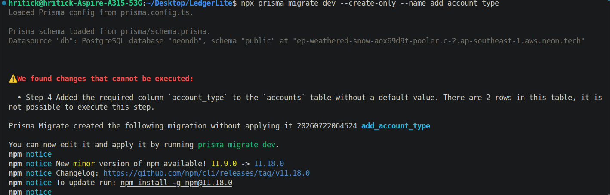

https://gemini.google.com/app/c80c04a827e2bfa0?hl=en-IN
https://gemini.google.com/app/f9e63e0eb6e122bc?hl=en-IN
https://gemini.google.com/app/ac7989284f2d8e87?hl=en-IN

https://chatgpt.com/g/g-p-6a49c38571148191bf064b777151e370-software-engineering-upskilling-2026/c/6a4c6aa6-8204-83ee-ba45-ef22e5db6863

# Express + Typescript Setup

https://chatgpt.com/g/g-p-6a49c38571148191bf064b777151e370-software-engineering-upskilling-2026/c/6a4c7308-d130-83e8-90d2-63a047aa78b9

# Prisma + Postgres setup

https://chatgpt.com/g/g-p-6a49c38571148191bf064b777151e370-software-engineering-upskilling-2026/c/6a4c8c9c-4fd0-83ee-8575-ea1a19beef44

# Primsa schema definition

https://chatgpt.com/g/g-p-6a49c38571148191bf064b777151e370-software-engineering-upskilling-2026/c/6a4c8eb0-6db4-83e8-81de-041c021e77ec

# Prisma back relations

https://chatgpt.com/g/g-p-6a49c38571148191bf064b777151e370-software-engineering-upskilling-2026/c/6a4cb254-a3a0-83ee-9d29-044f2c6eb458

Prisma Migrate is the source of truth for schema changes. You don't manually create tables in Neon.

# Error Handling

https://chatgpt.com/g/g-p-6a49c38571148191bf064b777151e370-software-engineering-upskilling-2026/c/6a508ff1-22dc-83ee-8ff7-34622fce45a7

In JavaScript, private properties are created by prefixing the property name with a hash (#) symbol. This native syntax enforces strict encapsulation, ensuring the properties can only be read or modified inside the class that defines them.

How TypeScript Parameter Properties WorkIn TypeScript, adding an accessibility modifier (like public, private, or readonly) directly to a constructor parameter forces the compiler to do two things automatically:Declare the property on the class instance.Assign the argument value to that property when the object is instantiated.The TypeScript Shorthand (Single Location)

class User {
// No need to declare "public name" or "readonly id" up here!
constructor(
public name: string,
readonly id: number
) {
// No need to write "this.name = name" here either!
}
}

const user = new User("Alice", 101);
console.log(user.name); // "Alice"

What the Compiler Automatically Generates

class User {
constructor(name, id) {
this.name = name; // Created and assigned automatically
this.id = id; // Created and assigned automatically
}
}

Thus for error hadnling in express 5 what is needed a gloabal AppError and error middleware, error is propagated automatically in express5 and a error handler middleware

# How to generate and use primsma client

https://chatgpt.com/g/g-p-6a49c38571148191bf064b777151e370-software-engineering-upskilling-2026/c/6a51a973-8808-83e8-b5e9-a3345b394c10

# Typed Params

https://chatgpt.com/g/g-p-6a49c38571148191bf064b777151e370-software-engineering-upskilling-2026/c/6a58830b-0a20-83e8-9587-0d0d335e4922

# Primsa migration strategy

'npx prisma migrate dev --create-only --name add_account_type'
Creates aan empty migration

after this you can add your manual constraint and then 'npx prisma migrate dev' - this command will execute the migration


# req.query vs req.params

In Express.js, req.params extracts data from the URL path itself using defined placeholders, while req.query captures optional key-value pairs attached to the very end of the URL after a question mark.


# Req validation in backend

This is a great question because **there are two separate concerns**:

1. **Runtime validation** (Zod)
2. **Compile-time typing** (TypeScript)

A production solution solves **both**.

---

# The problem

Suppose a request comes in:

```http
GET /transactions?limit=20
```

Express gives you:

```ts
req.query = {
  limit: "20",
};
```

After Zod:

```ts
{
  query: {
    limit: 20,
  },
}
```

Now the question is:

> **Where do we put this parsed object?**

---

# Option 1 — Parse in every controller (Simple)

```ts
const { query } = getTransactionsSchema.parse({
  query: req.query,
});
```

Pros:

- Very simple
- Fully typed

Cons:

- Repeated in every controller

---

# Option 2 — Mutate `req.body` (Common for body)

```ts
req.body = parsed.body;
```

Works because Express types

```ts
body: any;
```

---

# Option 3 — Mutate `req.query`

```ts
req.query = parsed.query;
```

This is where things break.

Express defines

```ts
query: ParsedQs;
```

which assumes values are strings.

Your parsed object now contains numbers, booleans, dates, etc.

TypeScript is protecting you.

---

# Production Pattern: Add a New Property

Instead of changing Express's properties, add your own.

For example:

```ts
req.validated = parsed;
```

Now your middleware becomes:

```
Incoming Request
       │
       ▼
Validation Middleware
       │
       ├── validate body
       ├── validate query
       ├── validate params
       ▼
req.validated
```

The original Express request remains untouched.

---

# Example

Middleware:

```ts
const parsed = schema.parse({
  body: req.body,
  query: req.query,
  params: req.params,
});

req.validated = parsed;

next();
```

Controller:

```ts
const { body, query, params } = req.validated;
```

Very clean.

---

# But TypeScript still complains...

Because Express doesn't know `validated` exists.

So we extend the Express `Request` interface.

Create something like:

```ts
declare global {
  namespace Express {
    interface Request {
      validated: unknown;
    }
  }
}
```

Now TypeScript knows

```ts
req.validated;
```

exists.

---

# But `unknown` isn't useful...

Correct.

Now we make the middleware generic.

Instead of

```ts
req.validated: unknown
```

we want

```ts
req.validated: z.infer<typeof schema>
```

For example

```ts
const schema = z.object({
  query: z.object({
    limit: z.number(),
  }),
});
```

Inside the controller, we'd like

```ts
req.validated.query.limit;
```

to be typed as

```ts
number;
```

---

# Here's the catch

A single global property cannot magically have a different type for every route.

One route has

```ts
{
  query: {
    limit: number;
  }
}
```

Another has

```ts
{
  body: {
    email: string;
  }
}
```

Another has

```ts
{
  params: {
    id: string;
  }
}
```

Which one should `req.validated` be?

TypeScript can't know unless the route itself carries that type information.

---

# What production frameworks do

Frameworks like **NestJS**, **tRPC**, **Hono**, and **Elysia** solve this by making the route handler generic.

Conceptually:

```ts
app.get<typeof schema>("/transactions", validate(schema), (req, res) => {
  // req.validated is inferred from `schema`
});
```

The type of the handler is linked to the type of the validation schema.

---

# What about Express?

Express wasn't designed with this in mind.

So most production Express + TypeScript codebases choose one of these:

1. **Parse inside the controller** (simple, very common)
2. **Store parsed data in `res.locals`** with custom typing
3. **Use a custom `TypedRequest` generic** for each route
4. **Accept a small type assertion** after middleware

---

## What recommended for LedgerLite

Since the goal is to become a strong backend engineer rather than build a framework, I'd do this progression:

1. **Current phase:** Parse `query` in the controller and use middleware for `body`.
2. **After you've built a dozen APIs:** Refactor to a `req.validated` or `res.locals.validated` pattern with Express type augmentation.
3. **Later:** Learn how frameworks like NestJS and Hono propagate Zod types through middleware. That will make the limitations of plain Express much easier to appreciate.

This way you learn the concepts in the same order they're typically encountered in real-world projects, without getting bogged down in advanced TypeScript before you've finished building your API.

# Fixes needed are

Remove || "" for userIds
Return only selected fields from services
Add index on transaction for normal last n transaction type current has where on type
fix expense enum type
